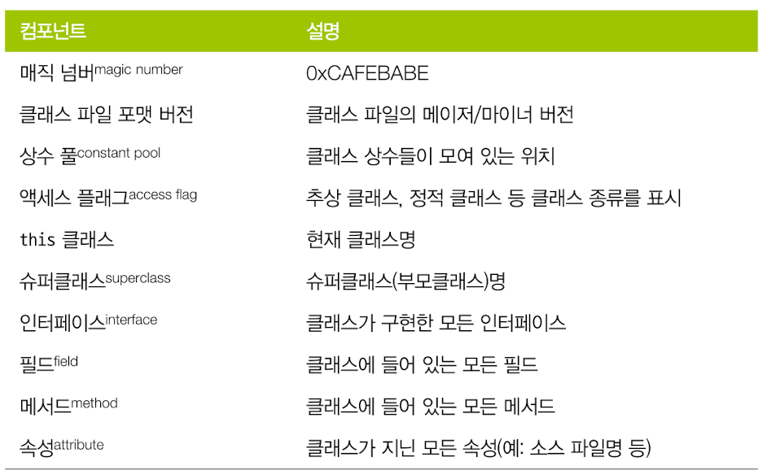

# 2. JVM 이야기

## 최 혁

---

# JVM

- JVM은 스택 기반 인터프리터 머신이다.
- 물리적인 CPU 하드웨어인 레지스터는 없지만 일부 결과를 실행 스택에 보관하며, 이 스택의 맨 위에 쌓인 값들을 가져와 계산한다.
- JVM 인터프리터는 평가 스택을 이용해 중간값들을 담아두고 가장 마지막에 실행된 명령어와 독립적으로 프로그램을 구성하는 opcode를 하나씩 순서대로 처리하는 `while문 안의 switch문`이다.

---

# 자바 애플리케이션 실행

1. 부트스트랩 클래스가 자바 런타임 코어 클래스를 로드한다. 부트스트랩 클래스로더는 다른 클래스로더가 나머지 시스템을 로드할 수 있게 최소한의 필수 클래스(java.lang.Object, Class 등)만 로드한다.
2. 확장 클래스로더가 생성되고 클래스로더가 차례대로 작동한다.
3. 애플리케이션 클래스로더가 생성되고 클래스패스에 위치한 유저 클래스를 로드한다.

---

### 자바 컴파일러

- 자바 소스 코드를 자바 컴파일러(javac)를 이용해 컴파일한다.(전체 빌드 프로세스의 한 부분)
- 자바 소스코드 -> .class 파일로 변환

### 바이트코드

- 바이트코드는 특정 컴퓨터 아키텍처에 특정하지 않은 중간 표현형(IR)이다.
- 컴퓨터 아키텍처의 지배를 받지 않으므로 이식성이 좋다.
- JVM은 클래스를 로드할 때 올바른 형식을 준수하고 있는지 검사한다.

---

## opcode

---

### 핫스팟

- 썬 마이크로시스템즈는 핫스팟 가상 머신을 만들어 C/C++ 같은 언어에 필적할 만한 성능을 끌어냈다.
- 핫스팟은 프로그램의 런타임 동작을 분석하고 성능에 가장 유리한 방향으로 영리한 최적화를 적용하는 가상 머신이다.

### JIT 컴파일

- 자바 프로그램은 바이트코드 인터프리터가 가상화한 스택 머신에서 명령어를 실행하며 시작된다.
- CPU를 추상화했기에 다른 플랫폼에서도 구동 가능하지만, 프로그램이 성능을 최대로 내려면 네이티브 기능을 활용해 CPU에서 직접 프로그램을 실행시켜야 한다.
- 이를 위해 핫스팟은 프로그램 단위를 인터프리티드 바이트코드에서 네이티브 코드로 컴파일한다. -> `JIT(Just-in-Time) 컴파일`

---

- 컴파일러가 해석 단계에서 수집한 추적 정보를 근거로 (핫스팟이) 최적화를 결정하는게 가장 큰 장점이다.
- 최신 성능 최적화를 보려면 핫스팟 새 버전에서 자바 애플리케이션을 실행하는 것이 좋다.

### JVM 메모리 관리

- C,C++등의 언어는 메모리 할당/해제 작업을 개발자가 직접 수행해야 하기에 메모리를 정확하게 계산해서 처리해야 하는 부담감이 있었다.
- 자바는 Garbage Collection이라는 프로세스를 이용해 힙 메모리를 자동 관리하는 방식으로 해결했다.
- Garbage Collection: JVM이 더 많은 메모리를 할당해야 할 때 불필요한 메모리를 회수하거나 재사용하는 프로세스

---

### 스레딩과 자바 메모리 모델(JMM)

- 자바는 1.0부터 멀티스레드 프로그래밍을 기본 지원했기에 개발자가 언제든 실행 스레드를 새로 만들 수 있다.
- 자바 환경도 JVM처럼 멀티스레드 기반이기에 성능 분석이 훨씬 힘들다.

### JVM 구현체 종류

OpenJDK, Oracle Java(라이선스를 제외하고 OpenJDK간 아무런 차이도 없다), Zulu, IcedTea, Zing, J9, Avian, Android

### JVM 모니터링과 툴링

- JMX: JVM과 그 위에서 동작하는 애플리케이션을 제어하고 모니터링하는 범용 툴
- 자바 에이전트: 자바 언어로 작성된 툴 컴포넌트로 java.lang.instrument 인터페이스로 메서드 바이트코드를 조작한다.
