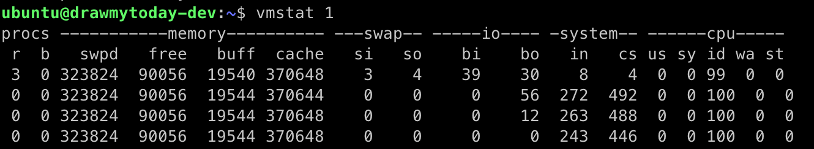
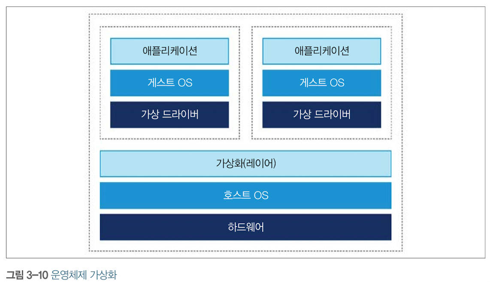

# 3. 하드웨어와 운영체제

## 최 혁

---

> 컴퓨터 성능 향상은 소프트웨어의 복잡도 향상으로 이어졌고, 그 결과 성능 향상을 꾀하려면 복잡한 기술에 의지해야 할 수밖에 없게 됐다.

---

# 메모리

- 무어의 법칙에 따라 급증한 트랜지스터는 클록 속도를 높이는데 쓰였고, 이에 프로세스 속도가 매우 빨라졌다.
- 하지만 시간이 갈수록 프로세서 코어의 데이터 수요를 메인 메모리가 맞추기 어려워졌다.(클록 속도와 액세스 속도의 차이 때문에 PU가 논다)
- 이에 CPU 캐시가 고안되었다. 자주 액세스하는 메모리 위치는 CPU가 CPU 캐시에 보관하는 아이디어이다.
- 메모리에 있는 데이터를 캐시로 가져오거나 캐시한 데이터를 메모리에 다시 쓰는 작업은 캐시 일관성 프로토콜이라는 방법으로 해결한다.

---

# 최신 프로세서 특성

- `변환 색인 버퍼(TLB)`는 여러 캐시에 쓰이는 장치로 가상 메모리 주소를 물리 메모리 주소로 매핑하는 페이지 테이블의 캐시 역할을 수행한다.
- `분기 예측`은 프로세서가 조건 분기하는 기준값을 평가하느라 대기하는 현상을 방지한다.
- 따라서 조건문을 평가하는 동안 발생 가능성이 큰 브랜치를 미리 결정하는 휴리스틱을 만들어 미리 추측한 결과를 바탕으로 파이프라인을 채운다.

---

# 운영체제

> 모든 리소스는 한정돼 있고 프로세스는 저마다 리소스를 더 차지하려고 하기에 골고루 나누어줄 중앙 시스템이 있어야 한다.

- 메모리 관리 유닛(MMU)을 통한 `가상 주소 방식`과 `페이지 테이블`은 메모리 액세스 제어의 핵심으로서, 한 프로세스가 소유한 메모리 영역을 다른 프로세스가 함부로 훼손하지 못하게 한다.

### 스케줄러

- 프로세스 스케줄러는 실행 큐(스레드나 프로세스가 CPU 차례를 기다리기 위한 대기 장소)를 이용하여 CPU 액세스를 통제한다.
- 스케줄러는 인터럽트에 응답하고 CPU 코어 액세스를 관리한다.

---

### 컨텍스트 교환

- 컨텍스트 스위치는 OS 스케줄러가 현재 실행중인 스레드/태스크를 없애고 대기중인 다른 스레드/태스크로 대체하는 프로세스이다.
- 유저 스레드 사이에 발생하든, 유저 모드에서 커널 모드로 바뀌면서 일어나든 컨텍스트 교환은 비싼 작업이다.
- 유저 스레드가 preemption 도중 커널 모드로 바꾸어 어떤 기능을 실행해야 할 때 모드가 바뀌면서 다른 캐시를 어쩔 수 없이 강제로 비워야 할 때가 있기에 캐시를 시스템 콜 반환 시 다시 채워야 하여 성능 저하로 이어진다.
- 컨텍스트 교환은 CPU 낭비를 초래한다.
- 리눅스는 가상 동적 공유 객체를 제공하여 이 현상을 방지한다.

---

# 기본 탐지 전략

> 애플리케이션이 잘 돌아간다는 것은 CPU 사용량, 메모리, 네트워크, I/O 대역폭 등 시스템 리소스를 효율적으로 잘 이용하고 있다는 뜻이다. 성능 진단의 첫 단추는 어느 리소스가 한계에 다다랐는지 밝히는 일이다.

### CPU 사용률

- 애플리케이션 성능을 나타내는 핵심 지표이다.
- 유닉스 계열 OS 명령줄에 vmstat, iostate 명령어를 통해 가상 메모리 및 I/O 서브시스템 상태에 관한 유용한 데이터를 신속히 제공해야 한다.

`vmstat 1`: 1초마다 한 번씩 찍어 다음 줄에 결과를 표시한다. 섹션별로 보면 다음과 같다.

---



- procs 섹션: 실행 가능한(r), 블로킹된(b) 프로세스 개수
- memory 섹션: 스왑 메모리, 미사용 메모리, 버퍼로 사용 가능한 메모리, 캐시로 사용 가능한 메모리
- swap 섹션: 디스크로 교체되어 들어간 스왑-인 메모리, 디스크에서 교체되어 빠져나온 스왑-아웃 메모리
- io 섹션: 블록-인, 블록-아웃 개수는 각각 블록 장치에서 받은 512바이트 블록, 블록 장치로 보낸 512 바이트 블록 개수이다.
- system 섹션: 인터럽트 및 초당 컨텍스트 교환 횟수
- cpu 섹션: cpu와 직접 연관된 지표를 %로 표기한다.

---

### Garbage Collection

- 가비지 수집을 하려고 커널 교환을 할 일이 거의 없다.
- 따라서 GC 자체는 유저 공간의 CPU 사이클을 소비하되 커널 공간의 사용률에는 영향을 미치지 않는 활동이다.
- 반면 JVM 프로세스가 유저 공간에서 CPU를 100% 가까이 사용하고 있다면 GC를 의심해야 한다.
- GC 로깅은 분석용 데이터의 원천으로서 가치가 높기에 JVM 프로세스는 GC 로그를 꼭 남겨야 한다.

---

### 입출력

- 자바 프로그램은 대부분 단순한 I/O만 처리하기에 I/O 서브시스템을 심하게 가동시키는 애플리케이션 클래스는 적다.
- 보통 I/O를 많이 쓰는 프로세스를 활발하게 모니터링하는 문화가 장착되어 있다.

### 기계 공감

- 기계 공감은 성능을 쥐어짜내는 상황에서 하드웨어를 폭넓게 이해하고 공감할 수 있는 능력이 무엇보다 중요하다는 생각이다.
- 고성능, 저지연이 필수인 분야에서 개발자가 자바/JVM을 효과적으로 활용하려면 JVM이 무엇이고, 하드웨어와는 어떻게 상호작용하는지 이해해야 한다.
- 만약 두 스레드가 동일한 캐시 라인을 수저애서 성능 저하가 발생하면 이런 일이 발생할 수 있음을 이해하고 해결 방법을 찾아야 한다.

---

> `가상화`는 다양한 종류가 있지만 보통 이미 실행중인 다른 OS 위에 OS 사본을 하나의 프로세스로 실행시키는 모양이다.
> 

---

# JVM과 운영체제

- JVM은 자바 코드에 공용 인터페이스를 제공하여 OS에 독립적인 실행 환경을 제공한다. 다만, 스레드 스케줄링같은 기본적인 서비스조차 하부 OS에 반드시 액세스해야 한다.
- 이런 기능은 native 키워드를 붙인 네이티브 메서드로 구현한다. 이 작업을 대행하는 공통 인터페이스를 자바 네이티브 인터페이스(JNI)라 한다.
- java.lang.Object 클래스에는 다음과 같이 non-private 네이티브 메서드가 선언되어 있다.

```java
public final native Class<?> getClass();
public final native void notify();
```
