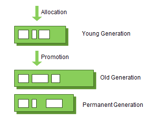
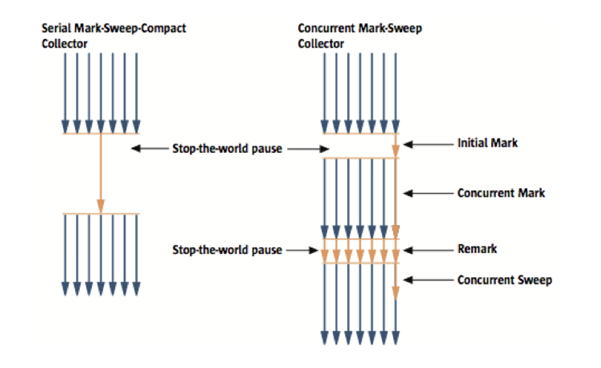
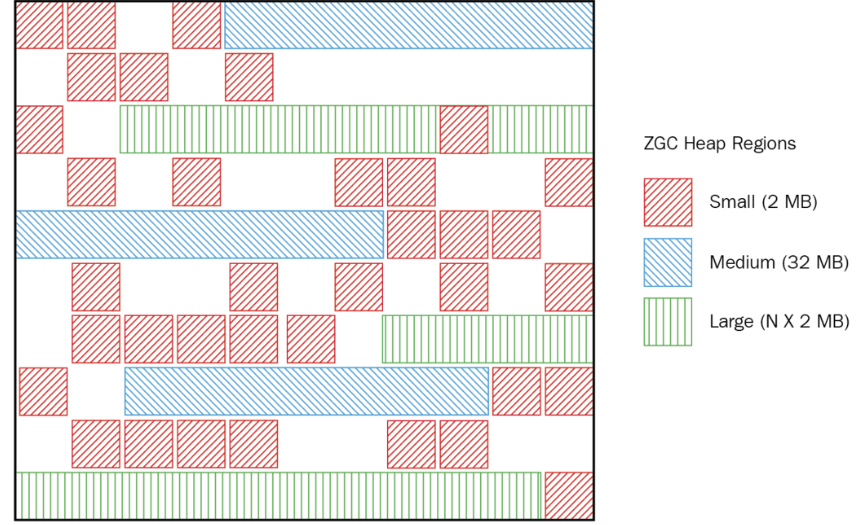

# GC의 종류와 특징

Garbage Collector 는 Java 개발자가 프로그램 코드로 메모리는 명시적으로 해제하지 않기 때문에 GC가 더 이상 필요없는 객체(쓰레기)를 찾아 지우는 작업을 한다. 그리고 이 GC는 두가지 전제 조건하에 만들어 졌다.

- 대부분의 객체는 금방 접근 불가능 상태(UnReachable)가 된다.
- 오래된 객체에서 젊은 객체로의 참조는 아주 적게 존재한다.

<aside>
💡 **STW (Stop the world)** : GC가 실행하기 위해 JVM이 애플리케이션 실행을 멈추는 행위, STW가 발생하면 GC를 실행하는 스레드를 제외한 나머지 스레드는 모두 작업을 멈춘다. GC가 작업이 완료된 후 중단했던 작업을 다시 시작한다.

</aside>

이 전제 조건을 weak generational hypothesis (약한 세대 가설)이라고 한다. 이를 위해 두가지로 물리적 공간을 나눴다.

- Young : 새롭게 생성한 객체의 대부분이 여기에 위치하며, 대부분의 객체가 금방 접근 불가능 상태가 되기 때문에 많은 객체가 Young 영역에 생성되고 사라진다. 이 영역에서 사라질 땐 Minor GC가 발생한다고 말한다.
- Old : 접근 불가능 상태로 되지 않아 Young 영역에서 살아남은 객체가 여기로 이동하며, 대부분 Young 영역보다 크게 할당하며 크기가 큰 만큼 Young 영역보다 GC는 적게 발생한다. Major(Full) GC가 발생한다고 말한다.

  

  GC의 영역 및 데이터 흐름도


# Serial GC

단일 스레드 환경에서 사용되며, GC 작업을 수행하는 동안 애플리케이션의 다른 스레드는 일시 중지 된다. 지금도 서버의 CPU코어가 1개라면 `Serial GC`가 사용된다. Minor GC에는 Mark-Sweep 을 사용하고 Major GC에는 Mark-Sweep-Compact 알고리즘을 사용한다.

- Mark : Old 영역에 살아있는 객체를 식별하는 것
- Sweep : Heap 의 앞 부분부터 확인하여 살아있는 것만 남긴다
- Compact : 각 객체들이 연속되게 쌓이도록 힙의 앞 부분부터 채워서 객체가 존재하는 부분과 객체가 없는 부분으로 나눈다.

# Parallel GC

Serial GC와 알고리즘은 같다. 하지만 Minor GC를 처리하는 스레드를 여러 개로 늘려 더 빠른 동작이 가능하게 하는 방식으로 메모리가 충분하고 코어의 개수가 많을 때 유리하다. Throughput GC라고도 부른다.

# Parallel Old(Compacting) GC

Parallel GC의 개선된 버전으로 Old 영역에 알고리즘만 다르며, Mark-Summary-Compaction 단계를 거치는데, Summary 단계는 앞서 GC를 수행한 영역에 대해서 별도로 살아있는 객체를 식별한다는 점에서 다르며, 더 복잡한 단계를 거친다.

# CMS(Concurrent Mark Sweep) GC

Heap 메모리의 크기가 클 때 사용하며, 다수의 스레드를 사용하면서 최소한의 pause 타임을 가지게 설계되었습니다. 애플리케이션이 실행되는 동안 GC와 프로세서의 리소스를 공유할 수 있습니다. 즉, 애플리케이션 스레드와 GC스레드가 동시에 실행되어 STW 시간을 최대한 줄이기 위한 GC입니다.

간단히 말하면 애플리케이션의 평균 응답 시간이 느려질 수 있지만 GC에 의해 애플리케이션이 정지되지 않는다는 장점이 있습니다.

Serial GC와 Parallel GC는 Compact라는 Sweep 후 남은 데이터를 정리하는 과정이 있지만 CMS GC는 Compact 과정을 사용하지 않고 다양한 Mark 과정을 거칩니다.

- Initial Mark : GC Root 에서 참조하는 객체들만 식별
- Concurrent Mark : 이전 단계에서 식별한 객체들이 참조하는 모든 객체를 추적
- Remark : 이전 단계에서 식별한 객체를 다시 추적, 추가되거나 참조가 끊긴 객체 확정
- Concurrent Sweep : 식별한 객체를 삭제

  

  Serial GC 와 CMS GC


# G1(Garbage First) GC

CMS GC를 대체하기 위해 고안된 GC로 JDK9 버전부터 디폴트 GC로 지정되었으며, 기존 GC의 알고리즘에서 Heap 영역을 물리적으로 고정된 Young / Old 영역으로 나눴지만, G1 GC는 이런 구조가 아닌 `Region`이라는 개념을 새로 도입했다.


전체 Heap 영역을 Region이라는 영역으로 체스같이 분할하여 상황에 따라 Eden, Survivor, Old등 역할을 고정이 아닌 동적으로 부여하여 유연하게 Garbage의 공간을 확보하므로 GC의 빈도가 줄어들게 됩니다.

# ZGC

JDK 15에서 정식 채택되었으며 17에 반영되었다. ZGC 는 메모리를 ZPage라는 Region을 재정의한 논리적인 단위로 구분한다.



ZGC Heap 영역의 메모리 구조

동적으로 생성/삭제 되며, 2MB의 배수 형태로 관리되며, ZPage는 세 가지 타입이 있다.

```java
const uint8_t _type; // zpage type

enum class ZPageType : uint8_t {
// type    size     object size limit      allignment
	small,     2M        <= 265K             <MinObjAlignmentInBytes>
	medium,   32M        <= 4M               4K
  large     X*M        >  4M               2M
};
```

여기서 주의해야 할 점은 Large 타입의 ZPage에는 단 하나의 객체만 할당할 수 있다는 것이다. 이는 곧 1~5MB 의 작은 크기의 객체를 할당해도 해당 ZPage는 더 이상 할당할 수 없어진다.

### Compact 개념

GC가 수행되면 힙 영역을 비우기 위해 살아있는 객체를 이동시키는데, 이 때 객체를 위치시키기 위해 빈 공간을 찾아야 하는데 이것은 새로운 영역을 할당하고 채우는 것보다 비싼 비용의 작업이다. 그래서 ZGC는 Compact의 과정을 기존 region의 빈 곳을 찾아 넣는게 아니라 새로운 region을 생성 후 살아있는 객체들을 채운다.

기존의 region 의 GC가 대상이 되어 처리 한다고 가정한다면, 기존 region 을 참조하던 region은 새로운 region으로 이동한 객체를 가리키게(remapping) 된다. 만약 이 때 remapping이 완료되기 전에 기존 region 의 객체 값을 변경하면 새로운 region과 기존 region의 값이 불일치 하게 된다.

이 문제를 해결하기 위해 ZGC는 몇 가지 전략을 사용한다.

- Concurrent GC를 사용해서 객체의 GC 메타데이터를 객체 주소에 저장 (Reference coloring, Colored Pointers) : GC 메타데이터를 객체의 메모리 주소에 표시하는데 ZGC는 64비트만 지원하는데 메모리의 주소 파트로 42비트(4TB)를 사용하고 다른 4비트를 GC metadata(finalizable, remap, mark1, mark0)를 저장하는 용도로 사용
- 애플리케이션 스레드는 힙 메모리에 있는 객체를 참조할 때 JIT를 사용해 GC를 돕기 위해 작은 코드를 만나게 된다. 이코드의 주소는 colored point가 bad color 인지 체크하고, 만약 bad color 라면 객체를 상황에 따라서 mark/relocate/remapping 한다. (GC load Barriers)
- Multi-mapping 으로 reference coloring에 의해 메모리 offset(주소) x 에 대해서 특정 시점에는 mark0, mark1, remap 비트 중 하나가 1이 되기에 offset x 에 페이지(ZPage)를 할당할 때 ZGC는 동일한 페이지를 3개의 다른 주소영역에도 할당한다.

### GC Phase

GC는 크게 marking, relocating이라는 두가지 중요한 단계를 가진다.

1. Mark Start 단계 : 모든 애플리케이션 스레드를 멈추고 각 스레드마다 가지고 있는 local variable들을 스캔한다. thread local variable에서 힙으로의 참조를 GC Root라고 하며 GC Root set을 만든다. 일반적으로 gc root개수는 적은 편이라 mark start 단계의 STW는 **극히 짧은 시간**이다.
2. Concurrent Marking 진행 : root set에서 시작해 객체 그래프를 탐색하며 도달할 수 있는 객체를 살아있는 것으로 표시한다. ZGC는 각 page의 livemap 이라고 부르는 곳에 살아있는 객체 정보를 저장한다. livemap 은 주어진 인덱스의 객체가 strongly-reachable하거나 final-reachable 한지 등의 정보를 비트맵 형태로 저장하고 있다. 이 단계에서 애플리케이션 스레드의 경우 load barrier를 통해 객체의 참조에 대해 테스팅을 진행하며, 참조가 bad color라면 slow_path로 진입한 후 Marking을 위해 thread-local marking buffer(queue)에 추가한다. 이 버퍼가 가득차면 GC 스레드가 이 버퍼의  소유권을 가져오고 이 버퍼에서 도달할 수 있는 모든 객체를 재귀적으로 탐색한다. 즉 애플리케이션 스레드에서의 marking은 주소를 버퍼로 넣기만 할 뿐 GC 스레드가 객체 그래프를 탐색하고 live map을 업데이트 하는 역할이다. 이 단계가 끝나면 살아있는 객체와 가비지 객체로 나뉜다.
3. Mark End : 모든 애플리케이션이 멈추고 Thread-local marking buffer를 탐색하며 비운다. 이때 marking 하지 않은 참조들 중 큰 하위 객체 그래프를 발견하면 처리해야하는 시간이 많아 STW가 길어질 수 있으므로 1ms 후 이 단계를 끝내고 Concurrent Mark 단계로 돌아간 다음 다시 Mark End단계로 진입한다.
4. Concurrent Processing : Concurrent Reset Relocation Set, Concurrent Destroy Detached Pages (비어있는 page는 메모리를 해제, 불필요한 클래스는 unload), Concurrent Select Relocation Set, Prepare Relocation Set(비워야하는 page들의 Set으로 relocation set 에 들어있는 page의 객체들을 대상으로 forwarding table을 할당한다. forwarding table은 기본적으로 객체가 재배치된 주소를 저장하는 hash map이다.)
5. Relocation Start : 모든 애플리케이션 스레드를 멈추고 relocation set의 page 객체 중 GC Root에 참조되는 것들은 모두 일괄 relocation/remapping 한다.
6. Concurrent Relocation : GC 스레드는 살아있는 객체를 탐색하고 아직 재배치되지 않은 모든 객체를 새로운 ZPage로 재배치하며 이 재배치는 애플리케이션 스레드를 통해 일어날 수도 있다.
7. Concurrent Remapping : 모든 재배치가 끝나면 old 객체가 아닌 새로운 객체로 참조를 변경한다. remapping은 애플리케이션 스레드의 load barrier에 의해서 진행되며 다음 GC cycle전까지 모두 완료되지 않을 수도 있다.

# 정리

ZGC의 목적 중 하나는 STW 상태를 10ms 이하로 가져가는 것을 목표로 한다. G1 GC 이전 GC들의 문제점인 Major GC 시 STW문제를 다시 겪지 않기위해서다. referenct 할당마다 실행되는 load barrier를 통해 GC에 필요한 작업들을 멀티 스레드로 애플리케이션 스레드와 동시에 진행한다.

참조

- [Naver Garbage Collection](https://d2.naver.com/helloworld/1329)
- [Naver ZGC의 기본 개념 이해하기](https://d2.naver.com/helloworld/0128759)
- [드림어스컴퍼니 ZGC에 대해서](https://www.blog-dreamus.com/post/zgc%EC%97%90-%EB%8C%80%ED%95%B4%EC%84%9C)