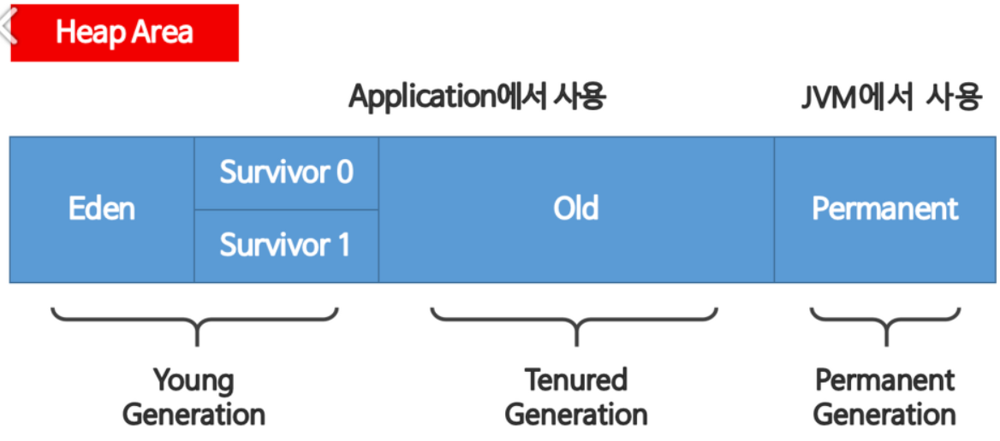

# 6. 가비지 수집 기초

## 최 혁

---

> **프로그래머가 저수준 세부를 일일이 신경쓰지 않는 대가로 저수준 제어권을 포기한다는 사상이 자바 관리 방식의 핵심이다.**

### grabage collector의 기본 원칙

1. 알고리즘은 반드시 모든 가비지를 수집해야 한다.
2. 살아있는 객체는 절대로 수집해선 안 된다.

---

# 마크 앤 스위프

- 자바에서 가비지 수집은 마크 앤 스위프 알고리즘을 기반으로 동작한다.
- 할당됐지만 회수되지 않은 객체를 가리키는 포인터를 포함한 allocated list를 사용하여 구현한다.

### 전체적인 GC 알고리즘

1. allocated list를 순회하면서 mark bit를 지운다.
2. GC 루트부터 살아있는 객체를 찾는다.
3. 이렇게 찾은 객체마다 mark bit를 세팅한다.
4. 할당 리스트를 순회하면서 mark bit가 세팅되지 않은 객체를 찾는다.
   a. 힙에서 메모리를 회수해 free list에 되돌린다.
   b. 할당 리스트에서 객체를 삭제한다.

---

# 가비지 수집 용어

### SWT (Stop The World)

> GC 사이클이 발생하여 가비지를 수집하는 동안 전체 애플리케이션의 실행이 멈추는 현상

### 동시

> GC 스레드는 애플리케이션 스레드와 동시(병행) 실행될 수 있지만 계산 비용 면에서 매우 비싸고 실상 100% 동시 실행을 보장하는 알고리즘은 없다.

### 병렬

> 여러 스레드를 동원해서 가비지를 수집한다.

---

### 이동

> 객체 주소는 고정되지 않았기에 이동 수집기에서 객체는 메모리를 여기저기 오갈 수 있다.

### 압착

> 할당된 메모리는 GC 사이클 마지막에 연속된 단일 영역으로 배열되며, 객체 쓰기가 가능한 여백의 시작점을 가리키는 포인터가 있다. 압착 수집기는 memory fragmentation을 방지한다.

### 방출

> 수집 사이클 마지막에 할당된 영역을 완전히 비우고 살아남은 객체는 모두 다른 메모리 영역으로 방출(이동)한다.

---

# 객체를 런타임에 표현하는 방법

- 핫스팟은 런타임에 **oop**(ordinary object pointer)라는 구조체로 자바 객체를 나타낸다.
- oop는 reference type 지역 변수 안에 위치한다.
- **instanceOop**: 자바 클래스의 인스턴스
- JVM 환경에서 자바 레퍼런스는 instanceOop(또는 null)을 제외한 어떤 것도 가리킬 수 없다.
  - 자바 값은 기본형 값 또는 instanceOop 주소에 대응되는 비트 패턴이다.
  - 모든 자바 레퍼런스는 자바 힙의 주 영역에 있는 주소를 가리키는 포인터이다.

---

# GC 루트 및 아레나

- **GC 루트**: 메모리의 고정점(anchor point)으로, 메모리 풀 외부에서 내부를 가리키는 포인터이다.
- GC 루트는 stack frame, JNI, register, 전역 객체 등 다양한 종류가 있다.
- 핫스팟 GC는 아레나라는 메모리 영역에서 작동한다.
- 핫스팟은 자바 힙을 관리할 때 시스템 콜을 하지 않는다.

---

# 할당과 수명

> **자바 애플리케이션에서 GC가 일어나는 주된 원인은 `할당률`과 `객체 수명` 때문이다.**

- 할당률: 일정 기간 새로 생성된 객체가 사용한 메모리량
- 객체 수명은 할당률처럼 측정하기 어렵기에 할당률보다 핵심적인 요인이다.

### 약한 세대별 가설

> **소프트웨어 시스템의 런타임 작동을 관찰한 결과 알게된 경험 지식(JVM 메모리 관리의 이론적 근간)**

가설에 따른 결론: GC하는 힙은 단명 객체를 쉽고 빠르게 수집할 수 있게 설계해야 하며, 장수 객체와 단명 객체를 완전히 떼어놓는게 가장 좋다.

---

# 힙 영역

---

- Heap 영역에 객체가 생성되면 최초로 Eden 영역에 할당
- 데이터가 어느정도 쌓이면 참조 정도에 따라 Servivor의 빈 공간으로 이동되거나 회수
- Young Generation 영역이 차게 되면 참조 정도에 따라 Old 영역으로 이동되거나 회수
- Old영역에 할당된 메모리가 허용치를 넘게 되면, Old 영역에 있는 모든 객체들을 검사하여 참조되지 않는 객체들을 한꺼번에 삭제하는 GC가 실행(stop-the-world)

### GC 종류

- Minor GC: Young Generation과 Tenured Generation 에서의 GC
- Major GC: Old영역의 메모리를 회수하는 GC

---

# 핫스팟의 가비지 수집

- JVM은 에덴을 여러 버퍼로 나누어 각 애플리케이션 스레드가 새 객체를 할당하는 구역으로 활용하도록 배포함
- **스레드 로컬 할당 버퍼(TLAB)**를 통해 다른 스레드가 자신의 버퍼에 객체를 할당하지 못하게 막는다.
- 애플리케이션 스레드가 버퍼를 다 채우면 JVM은 새 에덴 영역을 가리키는 포인터를 내준다.

---

# Parallel Collector

- Parallel GC: 가장 단순한 Young Generation 병렬 수집기
  - 스레드가 에덴에 객체를 할당하려는데 자신이 할당받은 TLAB 공간은 부족하고 JVM은 새 TLAB를 할당할 수 없을 때 Young Generation Collection이 일어남
  - Young Generation Collection이 일어나면 JVM은 전체 애플리케이션 스레드를 중단시킴
  - 스레드가 중단되면 핫스팟은 Young Generation을 뒤져서 가비지가 아닌 객체를 골라냄
- ParNew GC: CMS 수집기와 함께 사용할 수 있게 Parallel GC를 조금 변형한 것
- ParallelOld GC: Old Generation용 병렬 수집기
  - 하나의 연속된 메모리 공간에서 압착하는 수집기
  - old 세대에서 더 이상 방출할 공간이 없으면 병렬 수집기는 올드 세대 내부에서 객체들을 재배치해서 늙은 객체가 죽고 빠져 버려진 공간을 회수한다. (메모리 단편화가 일어날 일도 없다)

---

### Parallel Collector 특징

- Young Generation collection은 단명 객체 처리가 목적이기 때문에 영 공간의 점유 상태는 GC 이벤트가 발생할 때마다 메모리 할당 및 소거가 일어나면서 급격히 변함
- old 공간은 크게 눈에 띄는 변화가 없음

## 할당의 역할

- 자바의 GC 프로세스는 보통 유입된 메모리 할당 요청을 수용하기에 메모리가 부족할 때 작동하여 필요한 만큼 메모리를 공급한다. 즉, 그때그때 필요에 의해 발생한다.
