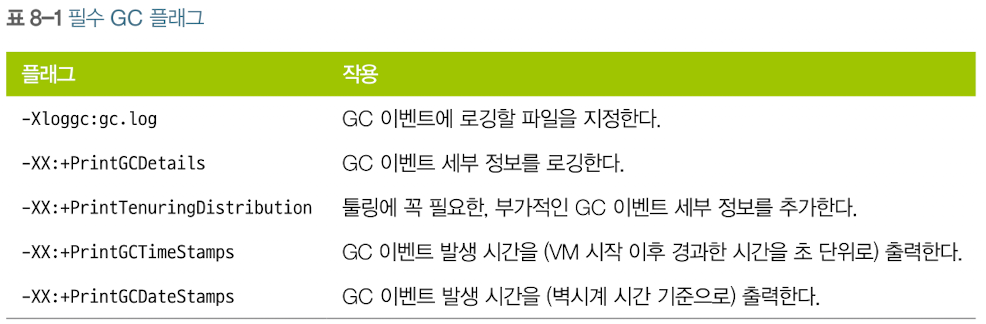

# GC 튜닝

## 최 혁

---

# CG 로그 보는 방법

### jstat

- HotSpot JVM에 있는 모니터링 도구
- GC 수행 정보 뿐만 아니라 클래스로더 수행 정보나 Just-in-Time 컴파일러 수행 정보 등도 볼 수 있다.
- 지정된 시간 간격마다 출력 정보를 볼 수 있다.

```shell
# pid에 해당하는 프로세스의 GC 수행 정보를 1초 간격으로 출력한다
jstat --gcutil <pid> 1s
```

---

### jstat 옵션

- `gc`: 각 힙(heap) 영역의 현재 크기와 현재 사용량(Eden 영역, Survivor 영역, Old 영역등), 총 GC 수행 횟수, 누적 GC 소요 시간을 보여 준다.
- `gccapactiy`: 각 힙 영역의 최소 크기(ms), 최대 크기(mx), 현재 크기, 각 영역별 GC 수행 횟수를 알 수 있는 정보를 보여 준다. 단, 현재 사용량과 누적 GC 소요 시간은 알 수 없다.
- `gcutil`: 각 힙 영역에 대한 사용 정도를 백분율로 보여 준다. 아울러 총 GC 수행 횟수와 누적 GC 시간을 알 수 있다.

---

### -verbosegc 옵션

- Java 애플리케이션을 가동할 때 지정하는 JVM 옵션
- GC가 발생할 때마다 로그 형태로 출력한다.



---

# GC 튜닝 smell 맡는 법

1. Xms 옵션과 –Xmx 옵션으로 메모리 크기를 지정하지 않았다.
2. server 옵션이 포함되어 있지 않다.
3. 시스템에 Timeout 로그가 남는다.

- 위 경우에 해당한다면 GC 튜닝을 하는 것이 좋다.
- GC 튜닝은 성능 튜닝의 가장 마지막 단계에 수행해야 한다.
  - GC가 많이 발생하는 근본적인 이유는 객체를 많이 생성했기 때문이기에 객체 생성을 줄이는 작업을 먼저 해야한다.

---

# Full GC 줄이기

- Full GC는 Minor GC보다 실행시간이 상대적으로 길기 때문에 여러 부분에서 TimeOut이 발생한다.
- Old 영역 크기를 줄이면?
  - Full GC 시간 단축 but OutOfMemoryError 발생 or Full GC 횟수가 늘어남
- Old 영역 크기를 늘리면?
  - Full GC 실행 시간 증가 but GC 횟수가 줄어듦

=> 결국 Old 영역의 크기를 적절하게 잘 설정해야 한다.

---

# GC 튜닝 절차

1. GC 상황 모니터링
2. 모니터링 결과 분석 후 GC 튜닝 여부 결정

GC 수행 시간이 1~3초 이상이면 GC 튜닝을 생각해볼 수 있다.

3. GC 방식/메모리 크기 지정
4. 결과 분석
5. 결과가 만족스러울 경우 전체 서버에 반영 및 종료

---

# GC 상황 모니터링 및 결과 분석

```shell
jstat -gcutil 709472 1s
  S0     S1     E      O      M     CCS    YGC     YGCT    FGC    FGCT    CGC    CGCT     GCT
 25.94   0.00  35.51  64.05  96.31  88.61   1932    6.778     5    8.854     -        -   15.632
```

Young Garbage Collection: 6.778 / 1932 = 0.0003s
Full Garbage Collection: 8.854 / 5 = 1.77s

---

# 메모리 크기 지정

- –Xms 옵션과 –Xmx 옵션을 통해 지정할 수 있다.
- 서버 자원이 좋은 시스템이라 메모리를 10GB로 설정해도 Full GC가 1초 이내에 끝난다면 10 GB로 지정해도 되지만, 보통은 10~30초정도 소요된다.
- GC 튜닝 이전에 현재 상황을 모니터링한 결과를 바탕으로 Full GC가 발생한 이후에 남아 있는 메모리의 크기를 봐야 한다.
  - 만약 Full GC 이후 300MB 남았다면 300MB(기본 사용) + 500MB(Old 영역용 최소) + 200 MB(여유 메모리)를 감안하여 1GB정도 지정
