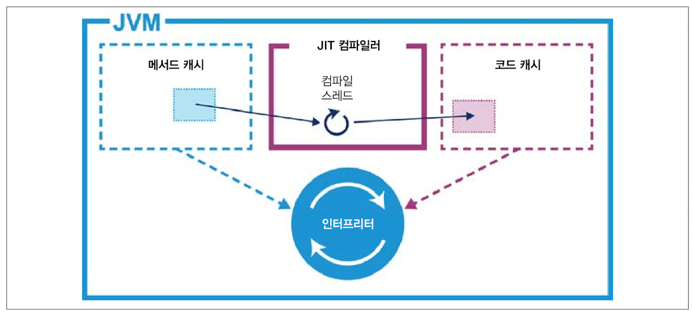
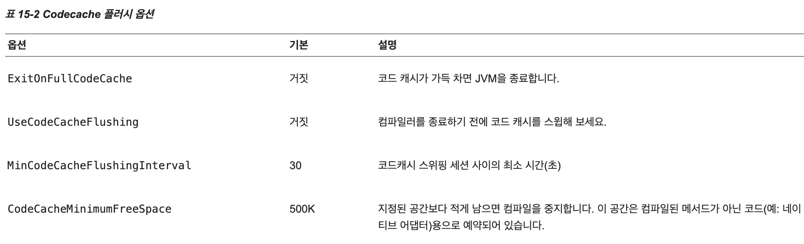

# JVM의 코드 실행

## 최 혁

---

# AOT 컴파일

    목표 시스템의 기계어와 무관하게 중간 언어 형태로 배포된 후 목표 시스템에서 인터프리터나
    JIT 컴파일 등 기계어 번역을 통해 실행되는 중간 언어를 미리 목표 시스템에 맞는 기계어로
    번역하는 방식을 지칭한다. (위키백과)

- AOT의 목표는 프로그램을 실행할 플랫폼과 프로세서 아키텍처에 딱 맞는 실행 코드를 얻는 것
- 대부분의 실행 코드는 자신이 어떤 플랫폼에서 실행될지 모르기에 AOT 컴파일한 바이너리는 CPU 기능을 최대한 활용하지 못하는 경우가 많다.

---

# JIT 컴파일

    프로그램을 실제 실행하는 시점에 기계어로 번역하는 컴파일 기법 (위키백과)

- 프로그램의 런타임 실행 정보를 수집해서 어느 부분이 자주 쓰이고, 어느 부분을 최적화해야 가장 효과가 좋은지 프로파일을 만들어 결정
- 이러한 기법을 프로파일 기반 최적화(PGO - profile guided optimization)라 한다.
- 바이트 코드를 네이티브 코드로 컴파일하는 비용은 런타임에 리소스를 소모하는 작업이므로 산발적으로 수행된다.

---

# AOT vs JIT

- AOT 컴파일 시 성능 향상이 있지만 확장성이 떨어진다.
- JIT 컴파일 방식은 새 릴리즈마다 jar 파일을 다시 컴파일하지 않아도 새로운 프로세서 기능에 관한 최적화 코드를 추가할 수 있다.

---

# 핫스팟 JIT

- 핫스팟은 멀티스레드 C++ 애플리케이션이기에 실행중인 자바 프로그램은 OS 관점에서 한 멀티스레드 애플리케이션이다.
- 핫스팟의 기본 컴파일 단위는 메서드이기에 한 메서드에 해당하는 바이트 코드는 한꺼번에 네이티브 코드로 컴파일된다.

---

# JIT 컴파일 로깅

- -XX:+PrintCompilation 옵션을 통해 컴파일된 메서드의 이름 및 클래스 정보 및 메서드가 JIT 컴파일되었는지 여부 등을 알 수 있다.
- -XX:LogCompilation 옵션을 통해 JIT 컴파일러가 어떤 결정을 내렸는지 더 자세한 정보를 알 수 있다.
- -XX:+UnlockDiagnosticVMOptions 옵션을 통해 VM이 바이트코드를 네이티브 코드로 어떻게 최적화했는지, 큐잉은 어떻게 처리했는지 관련 정보를 로그 파일로 출력할 수 있다.

---

# 핫스팟 내부의 컴파일러

- c1 컴파일러(클라이언트 컴파일러)
  - 가능한 빠른 실행 속도를 위해 코드를 가능한 빠르게 최적화하고 컴파일한다.
  - GUI 애플리케이션 및 기타 클라이언트 프로그램에 적합
- c2 컴파일러(서버 컴파일러)
  - 컴파일 시간이 C1 컴파일 시간보다 상대적으로 길지만 더 높은 수준의 최적화를 지원한다.
  - 실행 시간이 긴 서버 애플리케이션에 적합
- 두 컴파일러 모두 런타임에 바이트 코드를 기계어로 변환하는 과정을 최적화하고 코드 캐시에 캐싱한다.

---

# 핫스팟의 단계별 컴파일

    인터프리터 모드로 실행되다가 c1, c2로 방식을 바꾼다.

level 0: 인터프리터
level 1, 2, 3: c1 컴파일러
level 4: c2 컴파일러

- -XX:-PrintCompilation 옵션을 키면 JIT 컴파일러 동작을 볼 수 있다.

---

# JIT 컴파일 튜닝법

    JIT 튜닝 대원칙: 컴파일을 원하는 메서드에게 아낌없이 리소스를 베풀라

### 두 가지 사실을 체크

- 캐시 크기를 늘리면 컴파일드 메서드 규모가 유의미한 방향으로 커지는가?
- 주요 트랜잭션 경로상에 위치한 주요 메서드가 모두 컴파일되고 있는가?

### 튜닝 방법

1. PrintCompilation 스위치를 켜고 애플리케이션을 실행한다.
2. 어느 메서드가 컴파일됐는지 기록한 로그를 수집한다.
3. ReservedCodeCacheSize를 통해 코드 캐시를 늘린다.
4. 애플리케이션을 재실행한다.
5. 확장된 캐시에서 컴파일드 메서드를 살펴본다.

---

# 코드 캐시 튜닝

- 코드 캐시의 크기는 고정되어 있다.
- 코드 캐시가 가득 차면 `CodeCache is full… The compiler has been disabled` 경고 메시지가 뜬다.
- 코드 캐시 조정 VM 옵션
  - InitialCodeCacheSize – 초기 코드 캐시 크기: 기본 160K
  - ReservedCodeCacheSize – 코드 캐시 최대 크기: 기본 32M/48M
  - CodeCacheExpansionSize – 코드 캐시의 확장 크기: 기본 32k or 64k(코드 캐시 공간을 늘릴 때 한 번에 얼마만큼의 공간을 늘릴 것인지)

---

### 코드 캐시 플러시 옵션

- 코드 캐시가 가득 차면 컴파일된 메서드를 폐기하는 것을 코드 캐시 플러시라 한다.
- 기본적으로 코드가 가득 차면 인터프리터 모드로 바뀐다.
- 코드캐시를 제한하는 경우 코드캐시 플러시를 활성화하는 것이 좋다.(+UseCodeCacheFlusing)
- 대부분의 java 애플리케이션은 default codecache를 다 채우지 못한다.
  

---

# 참고

- https://docs.oracle.com/javase/8/embedded/develop-apps-platforms/codecache.htm#A1100181
- https://www.baeldung.com/jvm-code-cache
