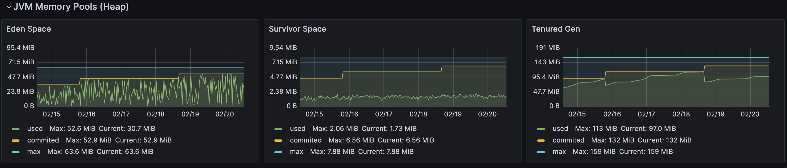
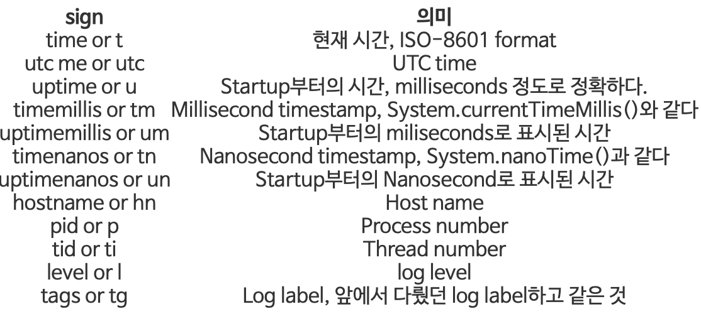
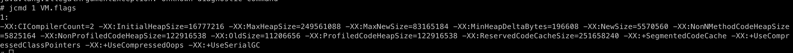
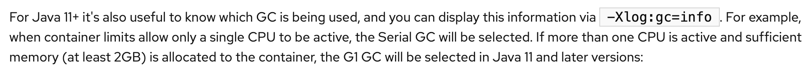

# G1GC 최적화

## 최 혁

---

# 현재 상황

- 3~4일에 한 번씩 Full GC가 일어난다.
- 첫 번째 Full GC STW는 10초였으나 두 번째 STW는 20초 걸렸다.

---

# 분석

- Tenured 영역에 할당된 메모리가 늘어날수록(90MB, 113MB, 132MB) STW 시간이 급격히 늘어나는 것을 볼 수 있다. (다음 GC는 30초가 걸릴 수도 있다)
- http request duration도 20초가 걸리는 것을 보아 유저가 최대 20초동안 중단되는 경험을 한 것으로 보인다.
- Survivor 영역에 적재되는 코드 캐시가 별로 없는 것을 보아 대부분 Eden 영역에서 Tenured 영역으로 조기 승격되는 것을 볼 수 있다.
- Full GC가 빈번하게 일어나지는 않기에 당장 해결해야될 문제는 아니지만, GC 로그를 출력하며 상황을 분석하고, 지켜볼 필요가 있다.

---

# G1GC 튜닝 전략

    G1 튜닝의 최종 목표: 앤드 유저가 최대 힙 크기와 최대 중단 시간을 간단히 설정하면 나머지는 수집
    기가 알아서 처리하게 하는 것

- 높은 처리량을 선호하는 경우: 힙 크기를 늘리거나 -XX:MaxGcPauseMillis 값을 높일 수 있다.
- 지연 시간을 줄이고 싶은 경우: -XX:MaxGcPauseMillis 값을 낮출 수 있다.

### 참고

- -XX:MaxGcPauseMillis 옵션은 최대 일시 정지 시간 목표값이다.
- 주의사항으로 young generation은 G1이 설정된 일시 중지 시간을 충족할 수 있도록 만드는 주요 수단이므로 -Xmn, -XX:NewRatio 등과 같은 옵션을 사용해 young generation의 크기를 특정 값으로 제한해서는 안된다.(특정 값을 설정할 경우 일시 중지 시간 제어가 무시됨)

---

# G1GC 튜닝을 위한 VM 옵션

### 로그 출력 설정

    출력 포멧: -Xlog[:[what][:[output][:[decorators][:output-options[,...]]]]]

    -Xlog:gc*=debug:file=./logs/gc-%t.log:t,level,tags:filecount=50,filesize=100M

- gc+age, gc+heap 등 어떤 태그에 대한 설정을 구성할지 지정 가능
- gc\*는 모든 태그를 뜻한다.
- decorators 종류는 매우 다양하다.

---

---

# 충격적인 사실

- 모니터링 시스템을 보며 G1GC는 보통 full gc가 잘 일어나지 않지만 이상하게 많이 일어나고, STW도 길었다.
- 혹시나하는 마음에 java 옵션과 jcmd를 통해 gc 버전을 살펴보니 Serial GC가 돌아가고 있었다!

- RedHat 문서를 보니.. Container환경에서는 CPU Core를 2개 이상 사용하면서 Memory가 2G 이상이여야 G1GC가 채택되고, signle CPU는 Serial GC만 채택된다는 것이다.

---

따라서 -XX:+UseG1GC 옵션을 주어 정말 불가능한지 테스트했지만 역시나 옵션이 적용되지 않았다.

다음주에 Serial GC 최적화에 대해 다시 조사하겠습니다..

---

# 참고

- https://johngrib.github.io/wiki/java/gc/g1gc/
- https://velog.io/@hanblueblue/GC-2.-G1GC-tuning#3%EF%B8%8F%E2%83%A3-%EC%B2%98%EB%A6%AC%EB%9F%89-%EC%A1%B0%EC%A0%95
- https://velog.io/@akfls221/JVM%EC%9C%BC%EB%A1%9C-%EC%8B%9C%EC%9E%91%ED%95%B4-GC-%EA%B7%B8%EB%A6%AC%EA%B3%A0-GC-%ED%8A%9C%EB%8B%9D%EA%B9%8C%EC%A7%80
