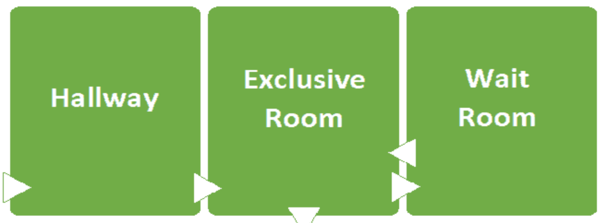

# Lock 알아보기

## 최 혁

---

# monitor

    thread가 mutual exclusion 및 cooperation할 수 있도록 지원하는 동기화 매커니즘

- mutual exclusion(상호 배제): 동시에 여러 스레드나 프로세스가 공유 자원에 접근하는 것을 방지하도록 제한하는 개념
- cooperation: 특정 조건이 충족될 때까지 스레드를 대기시키는 기능

### monitor의 특징

- 한 번에 하나의 스레드만 critical code section에 mutually exclusive하게 접근할 수 있음
  - critical section: 여러 스레드를 통해 동일한 데이터에 접근하는 코드
- 모니터에서 실행 중인 스레드가 특정 조건이 충족될 때까지 차단될 수 있음
- 스레드는 조건이 충족될 때 다른 스레드에 알릴 수 있음

---

### java에서 monitor 구현

- Java는 critical sections를 표시하기 위해 동기화된 키워드를 사용
- mutual exclusion은 모든 연관된 object 및 클래스에 대한 lock으로 수행되는데 잠금은 binary semaphore이며, mutex라고 불림
  - semaphore: mutual exclusion를 구현하기 위한 동기화 기법 중 하나로 잠금 매커니즘을 사용
  - mutex: binary semahore와 같음

---

### 전용실로의 비유

> monitor 메커니즘에 대한 Java의 구현은, entry set 와 wait set 개념을 가정한다



- 복도(entry set), 전용실(동기화된 리소스), 대기실(waiting set)은 하나의 건물(monitor)이다
- 스레드는 전용실에 들어가고 싶은 사람들이다
- 모니터에 들어가기(건물에 들어가기) -> 모니터 획득(전용실 입장) -> 모니터를 소유하는 것(전용실에 있는 것) -> 모니터 해제(전용방 나가기) -> 모니터에서 나가기(건물에서 나가기)

---

> Java가 백그라운드에서 뮤텍스 & 세마포어로 모니터 영역을 만들기에 다중 스레드 응용 프로그램에서 세마포어를 직접 작성할 필요 없이 동기화된 키워드로 critical section을 래핑하면 된다

---

# java.util.concurrency.Locks

    Lock은 잠금은 동기화 블록보다 더 유연하고 정교한 스레드 동기화 메커니즘

### 기존 synchronized block과 Lock의 차이점

- ReentrantLock은 공정한 잠금(fair lock)을 제공하기에 잠금이 해제된 후 가장 오랫동안 대기한 스레드에게 잠금을 부여하는 방식으로 동작함
- synchronized block은 스레드가 critical saction에 액세스할 수 없으면 스레드가 차단되지만 Lock API는 tryLock() 메서드를 통해 다른 스레드가 보유하지 않는 경우에만 잠금을 획득함
- synchronized block은 액세스를 얻기 위해 대기 상태에 있는 스레드는 중단될 수 없다. Lock API 는 잠금을 기다리는 동안 스레드를 중단하는 데 사용할 수 있는 lockInterruptible() 메서드를 제공한다

---

# Lock API

- void lock(): 사용 가능한 경우 잠금을 획득하고, 잠금을 사용할 수 없으면 잠금이 해제될 때까지 스레드가 차단됨
- void lockInterruptible(): lock() 과 비슷하지만 차단된 스레드가 중단되고 java.lang.InterruptedException이 발생하여 실행을 재개할 수 있음
- boolean tryLock(): lock() 메서드 의 비차단 버전으로 즉시 잠금 획득을 시도하고, 잠금에 성공하면 true를 반환
- boolean tryLock(long timeout, TimeUnit timeUnit): Lock 획득 시도를 포기하기 전에 지정된 시간 초과까지 기다림
- void Unlock(): 잠금 해제

---

### Lock 사용하는 방법

```java
Lock lock = ...; (Lock 구현체)
lock.lock();
try {
    // access to the shared resource
} finally {
    lock.unlock();
}
```

- Lock 인터페이스 외에도 읽기 전용 작업용 잠금과 쓰기 작업용 잠금의 쌍을 유지하는 ReadWriteLock 인터페이스가 있다
- Lock의 구현체는 ReentrantLock, ReadWriteLock의 구현체는 ReentrantReadWriteLock이 있다
- 자바 8 이후로 StampedLock이 도입됐다

---

## 참고

- https://jayhyun-hwang.github.io/2021/08/23/Monitor/
- https://www.baeldung.com/java-concurrent-locks
- https://parkjeongwoong.github.io/articles/Web/24
