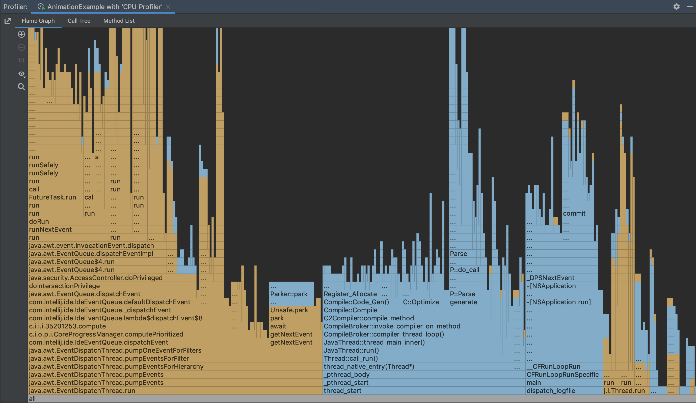
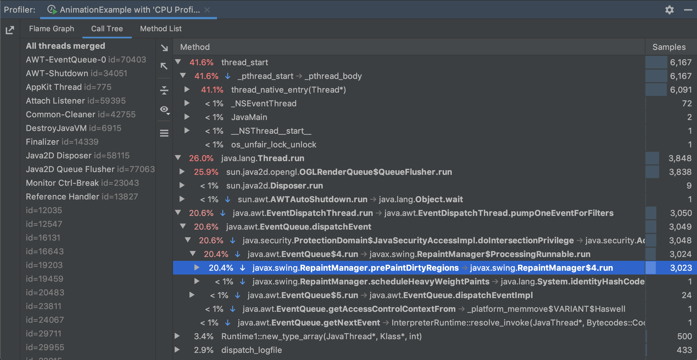
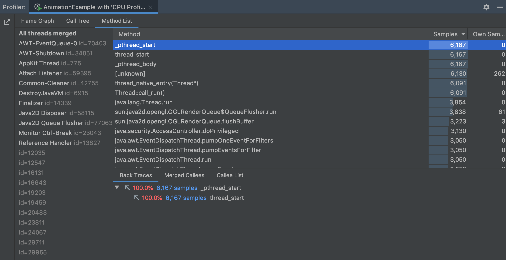
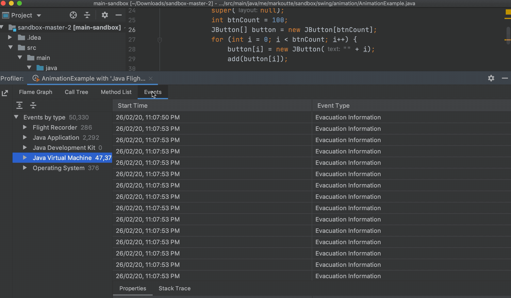
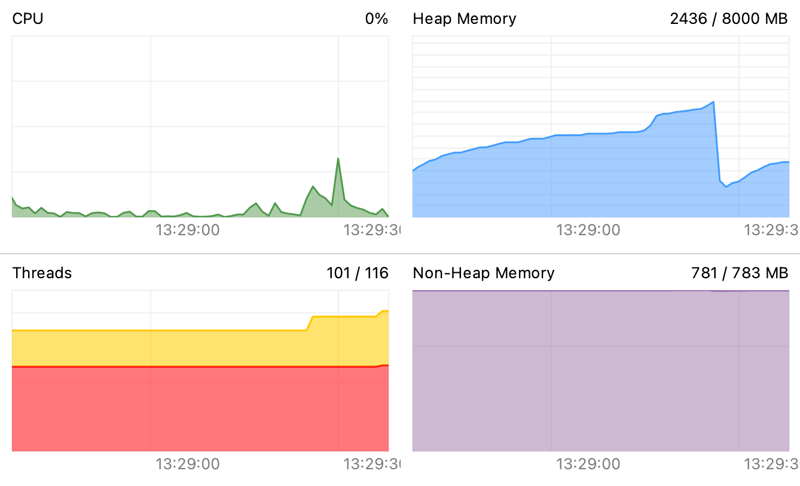
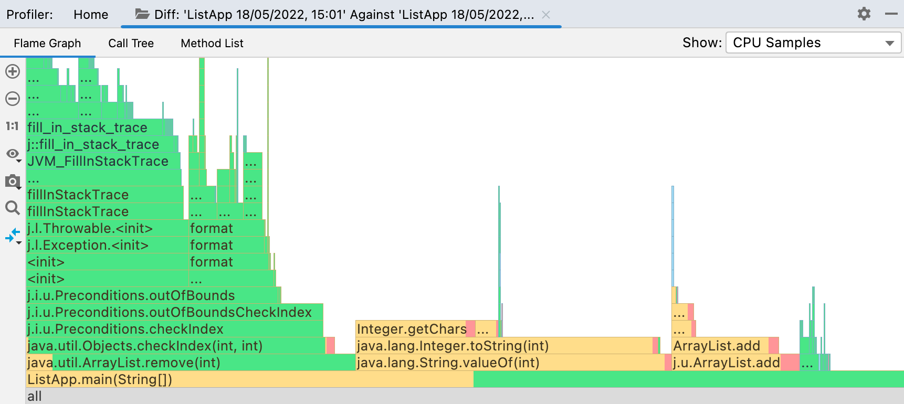
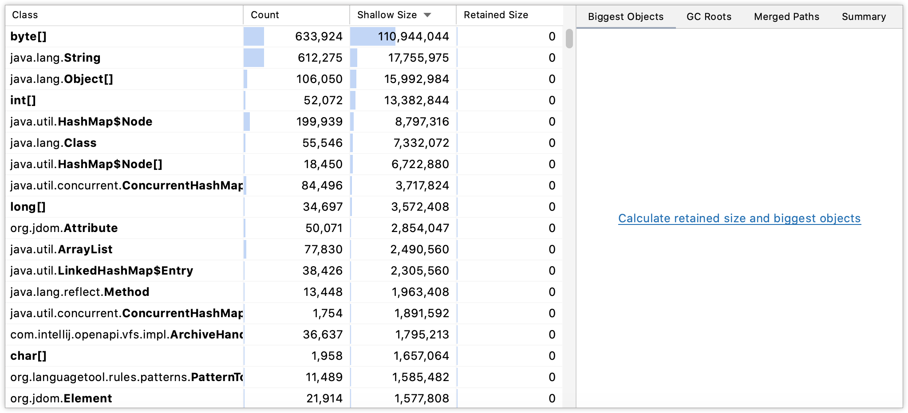

# IntelliJ Profiler 사용해보기

⎯ 남궁민

---

## 취지

- 상용 프로파일링 툴을 학습 단계나 사이드 프로젝트에서 사용하기엔 무리
- 어짜피 상용 툴의 적용 방법은 대부분 java agent를 부착하는 방식
- 오픈 소스인 perf 를 활용하는 방식은 복잡한 느낌
- 간단하게 사용할 수 있는 프로파일러를 사용해보면서 프로파일링 개념 및 방법을 숙지해보자

---

## 14 Chapter에 대한 소견

로깅

- 모든 애플리케이션에서 중요한 부분이지만 결국 어떤 도구를 사용할 것인지에 대한 문제
- Logback, Log4j의 차이점에 대해서 정리하면 좋긴 할 듯!

메시징

- 시중에서도 많이 사용되는 Kafka, RabbitMQ 등의 메시징 시스템을 배우는 편이 더 나을 듯
- 하지만 거의 책 한 권을 공부해야 할 것 같은 깊이

 

⇒ 그래서 13 Chapter의 내용을 더 고도화하기로

---

## IntelliJ Profiler 소개

⚠️ IntelliJ IDEA Ultimate 에서만 사용 가능

- CPU 사용률, 메모리 할당 프로파일링을 위한 단순하지만 강력한 툴
- 2개의 유명한 자바 프로파일러인 JFR(Java Flight Recorder), Async Profiler 를 결합한 툴
  - JFR: JDK에 내장된 표준 프로파일링 툴
  - Async Profiler: native call과 메모리 할당을 수집하는 매우 정확한 프로파일러
- **주 관심사는 편한 사용성!**
  - 복잡한 설정 없이 몇번의 클릭만으로 프로파일링을 할 수 있게 해줌
- 다른 프로세서에도 쉽게 연결할 수 있고 해당 프로세서에 대한 스냅샷을 저장할 수도 있음
- **flame graph** 기능을 통해 다양한 접근 방식의 성능을 빠르고 효과적으로 분석할 수 있음
- Windows, macOS, Linux 지원

---

## CPU profiling

- 실행 중인 모든 스레드에 대한 stack traces에서 주기적으로 샘플 수집
- 이를 달성하기 위해 JVM과 OS API 모두 사용
- instrumentation-based profiler와 달리 모든 메소드 엔트리를 캡쳐링하지 않고 정기적인 샘플링을 통해 CPU 사용률을 측정
  - 작은 부분의 측정 데이터 손실이 있음
  - 대신 편향 없는 측정 데이터 위주로 제공
  - 프로파일링 작업이 애플리케이션에 더 적은 영향을 미침

---

## Memory allocation profiling

- IntelliJ Profiler는 메모리 할당 이벤트에 반응
- 이벤트 발생 시 호출 스택과 할당된 객체의 타입 기록
- 할당을 수행하는 코드 경로와 할당 규모를 파악하는 데 도움이 됨
- CPU profiling과 마찬가지로 최소한의 의미 있는 데이터만 기록

---

## Flame Graph

---

- x축: 샘플 모집단
- y축: 스택의 깊이
- 모든 직사각형은 함수 이름을 나타냄
  - 파란색 직사각형: native code
  - 노란색 직사각형: project code
  - 보라색 직사각형: library code
- 시계열이 아님 (애플리케이션에서 메소드를 호출하는 순서를 표시하는 게 아님)
- 각 블록들은 상대적이며, CPU 스냅샷에서의 총 사용 시간을 나타냄
- 한번 실행할 때 오래 걸린 게 아니라 여러 번 호출되어서 비율이 높은 것일 수도 있음

---

## Call Tree

---

- flame graph를 텍스트 형식으로 표현한 것
- 메소드들이 어떻게 호출되었고, CPU 시간을 얼만큼 사용했는지 표현
- 어떤 메소드 실행 경로가 느린지 검토해보고, 중요한 실행 경로를 조정하는데 도움이 됨

---

## Method List

---

- 프로파일할 때 실행된 메소드 목록을 보여줌
- IntelliJ IDEA에서 메소드를 클릭하면 해당 메소드의 소스 코드로 이동할 수 있음

---

## Events

---

- 클래스 로딩, GC, OS 이벤트 같은 JVM 이벤트를 보여줌

---

## Live Chart

---

---

- 실행 중인 프로세스에 대해 실시간 성능 통계를 보여줌
- `Perform GC` 버튼을 누르면 GC를 수동으로 실행할 수 있음
- CPU: CPU 사용률
- Heap Memory: 힙 메모리 사용률 (현재 사용량 / 최대 힙 사이즈)
- Threads: 활성 스레드 수
  - 노란색: 전체 스레드 개수
  - 빨간색: 데몬 스레드 개수
- Non-Heap Memory: 힙 메모리를 제외한 메모리 사용률
  - JVM 작동에 필요한 JVM 객체 저장 용도

---

## Compare profiler snapshots

---

- 2개의 스냅샷을 열어두고 비교 버튼 클릭
- flame graph에서 녹색으로 표시되면 기준에 비해 샘플이 더 적다는 뜻, 빨간색은 더 많다는 뜻

---

## Memory Snapshot

---

왼쪽 화면

- Shallow size: 객체 자체의 할당된 메모리 양, 해당 객체가 참조하는 객체들의 크기는 포함되지 않음
- Retained size: GC 수행을 통해 회수할 수 있는 메모리 양

---

오른쪽 화면

- Biggest Objects: 유지된 메모리 사이즈가 가장 큰 객체 목록
  - 개별 객체들 중에서 메모리 누수를 일으킬 수 있는 객체를 찾는 데 도움이 됨
- GC Roots: 스냅샷 생성 시점에 GC를 수행할 수 없는 객체 목록
  - 어떤 클래스로더가 메모리 소비를 차지하는지 확인하는 데 도움이 됨
- Merged Paths: 클래스별 객체 그룹 표시
  - 해당 클래스의 인스턴스가 왜 유지되고 있는지 이해하는 데 도움이 됨
- Summary: 총 사이즈, 인스턴스 개수, 스레드에 대한 stack traces 등을 표시
- Packages: 모든 객체에 대한 분석을 패키지별로 표시
  - 서브시스템의 메모리 소비 및 메모리 누수 현황을 파악하는 데 도움이 됨

---

Object view

- Shortest Paths: GC 루트에 대한 최단 경로
- Incoming References: 다른 인스턴스로부터 들어오는 참조
- Dominators: 해당 인스턴스를 유지하고 있는 객체, 모든 인스턴스에 하나만 있거나 하나도 없음
- Retained Objects: 해당 객체를 유지하는 객체를 선버스트 다이어그램으로 표시
- Dominator Tree: 보유한 객체들을 트리로 표시

---

## References

- [Baeldung - A Guide to Java Profilers](https://www.baeldung.com/java-profilers)
- [The IntelliJ IDEA Blog - Profiling Tools and IntelliJ IDEA Ultimate](https://blog.jetbrains.com/idea/2020/03/profiling-tools-and-intellij-idea-ultimate/)
- [IntelliJ docs](https://www.jetbrains.com/help/idea/profiler-intro.html)
