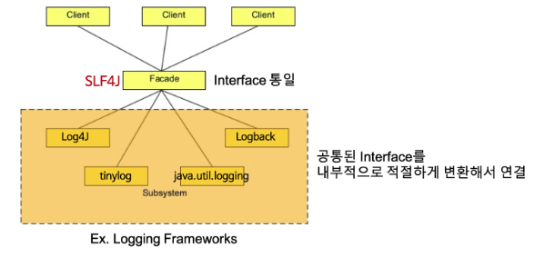

# chapter14. logging

# 개요

로깅 라이브러리에 대해 알아보자

| 종류 | 설명 | 분류 |
| --- | --- | --- |
| Slf4j | 여러 로깅라이브러리를 추상화해서 사용하기 위한 파사드 패턴의 로깅 인터페이스이다. | 파사드 |
| Log4j | Apache Logging 라이브러리로 개발중단되었다. | 구현체 |
| Logback | Log4j의 개선된 버전으로 Slf4j를 함께 사용한다. 스프링 부트의 디폴트 라이브러리로 포함되어 있다. | 구현체 |
| Log4j2 | Log4j&Logback의 개선된 버전으로 비동기로 동작하며 고성능으로 다양한 로깅 레벨을 지원한다. | 구현체 |

## SLF4J (Simple Logging Facade for Java)



참조 : https://programmingrecoding.tistory.com/69

인터페이스로 사용하는 라이브러리로 구현체를 주입해야 사용이 가능하며, 다양한 로깅 구현체를 변경해도 실제 코드단에서 변경을 최소화하기 위해 사용된다.

```java
public SLF4JLogger(final String name, final Logger logger) {
	super(name);
	this.logger = logger;
	this.locationAwareLogger = logger instanceof LocationAwareLogger ? (LocationAwareLogger)logger : null;
}
```

쉽게 Logger를 변경할 수 있다.

## Log4j

멀티스레드 및 속도와 유연성을 제공하며 다양한 로그레벨을 제공하지만 로그를 높은 트래픽에서 사용하게 되면 성능에 영향을 미치거나, IO시 런타임 오버헤드가 발생하는 등의 이유로 인해 개발이 중단되었다.

## Logback

Log4j의 대안으로 개선된 버전으로 SLF4J 를 통해 연관 라이브러리들이 다른 로깅 프레임워크를 사용해도 logback으로 통합할 수 있으며 다음과 같은 아키텍처를 가지고 있습니다.

줄 단위로 기록을 하는 대신 StringBuffer를 사용하여 버퍼링하며 GC 오버헤드가 Log4j 에 비해 적습니다.

- Logger : 로깅 요청을 받고 Context를 전달하며, 계층 구조로 부모 Logger를 상속받습니다. 로깅 메시지와 레벨을 전달합니다.
- Appender : Logger로 부터 받은 메시지를 특정 대상(콘솔,파일,메일,DB등)에 출력하는 역할입니다.
- Encoder : 로그 메시지를 인코딩하는 역할이며, 인코딩된 메시지는 어펜더를 통해 출력
- 그외에도 Layout, Filter, Context, Slf4j등의 아키텍처로 이루어져 있습니다.

## Log4j2

최신 로깅 라이브러리로 Log4j → Logback → Log4j2 순으로 개발되었으며, 불필요한 메모리 할당과 GC를 최적화하여 높은 처리량을 보이는데, 이는 단순히봐도 18배 이상 차이가 난다고 합니다.

비동기 로깅으로 성능상 이점을 가져가며, 로그 이벤트를 별도의 스레드로 분리해 처리합니다. 그러면서 플러그인 아키텍처를 도입하여 쉽게 새로운 기능을 추가할 수 있으며 Appender, Layout, Filter 등을 제공합니다.

구성 파일의 변경을 자동으로 감지하고 reload 할 수 있으며, 기본 구성을 자동으로 설정할 수 있어 간편하게 사용할 수 있고, 람다 표현식등 간결한 문법을 지원합니다.

- LoggerContext : Logger와 구성요소들을 관리하는 객체
- Logger : 로깅 요청을 받고 Context에 전달하며 계층구조로 이루어짐
- Appender : 로깅 메시지를 특정 대상에게 출력
- Layout : 출력 형식을 지정
- Filter : 로그 메시지를 필터링
- Configuration : 구성 정보를 읽고 초기화하며 XML, JSON, YAML등 다양한 파일 형식을 지원합니다.